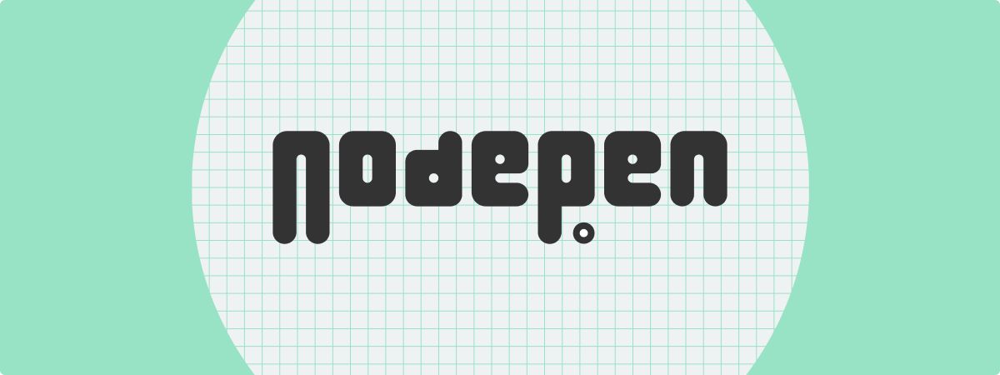

<div>


</div>
<br />

Nodepen is a web client for Grasshopper. This monorepo is for the main `@nodepen/nodes` React app library and its supporting packages.

This project is under active development towards a 2.0 release that will:

- Publish useful bits of the [previous release](https://github.com/nodepen/nodes/releases/tag/1.0.0) as independent libraries
- Integrate with Speckle for backend processes and frontend visualization

## Features

- Compose, execute, and view results from your Grasshopper graphs in the browser
- Upload an existing script and continue working on the web
- Easily pin any number of parameters for a quick configurator-like experience
- Open the same graph in multiple browser windows for the "two screen" UX we've come to love with Rhino and Grasshopper
- Download your current graph to continue work in Grasshopper offline

## Project Structure

This monorepo contains the core NodePen libraries (`/packages`) and a collection of example applications (`/apps`) that use them. The applications are meant to be a simple demonstration of how to run a Grasshopper-like environment and how NodePen integrates with Speckle technology.

### Packages

NodePen currently supports three core libraries:

#### @nodepen/nodes

A React component library that exports the main NodePen client-side "app" for interacting with nodes and viewing results. It also exports the individual "views" which may be included and configured as necessary.

#### @nodepen/core

A typescript library that exports types and utilities for NodePen concepts. Useful if you need to perform operations with NodePen-shaped data but do not need to include the client-side logic.

#### NodePen.Converters

A C# library that can be used to serialize/deserialize types to/from the NodePen Document JSON format.

### Apps

#### nodepen-client

A thin next.js client that communicates directly with the Rhino Compute server for Grasshopper solutions and the Speckle server to receive results from Speckle streams.

#### rhino-compute-server

A minimal Rhino Compute server with endpoints for updating a given NodePen document. Writes results directly to the local Speckle server instance it's configured to point to.

## Local Development

Running NodePen locally requires a number of dependencies and, at the moment, a bit of manual work for first-time setup. Please also see the section below about known limitations.

### Dependencies

In order to run all of the example applications, you will need:

- Git with SSH auth
- Nodejs 16, 18
- Dotnet CLI
- Rhino 7+
- Access to a running Speckle Server

### Initial Setup

Clone this repo:

```
git clone git@github.com:nodepen/nodes.git
```

From the root directory, run:

```
npm i
npm run build
```

This should install dependencies for all of the javascript projects and build them once. Build failures may still occur for the last project, `nodepen-client`, and can be ignored.

From `/apps/rhino-compute-server` run:

```
dotnet build
```

This should restore dependencies for and build both the example application and NodePen.Converters.

Last, follow [Speckle's instructions](https://speckle.guide/dev/server-local-dev.html) for how to set up your local development environment for the speckle-server project. Run the server.

Visit your local Speckle server and:

- Create your admin user (the first user on the server)
- Create a new stream
- [Create a personal access token for your account](https://speckle.guide/dev/tokens.html).

Alternatively, you may also source these values from a live Speckle server you have access to.

In `apps/nodepen-client`, copy `.env.development` to a `.env.development.local` and populate each environment variable with the relevant information from the previous steps.

In `apps/rhino-compute-server`, copy `appsettings.json` to an `appsettings.local.json` and populate the named variables in the same way.

At this point, you may leave your Speckle server running and continue onto the next section.

### Development Environment

Both services in the `/apps` directory must be running in order to develop with NodePen locally. For all current features, you must also have access to a running speckle server (local or otherwise).

Once all three are successfully running, you can navigate to `http://localhost:4000` to begin working.

You can validate that everything is working by dropping a grasshopper script onto the canvas and viewing the results in the next tab. (Please see the limitations section below if you script does not appear.)

#### nodepen-client

From the root directory, run:

```
npm run dev
```

This uses turborepo to watch and react to changes made in either the client application or any of the packages it consumes.

#### rhino-compute-server

From the `apps/rhino-compute-server` directory, run:

```
dotnet watch
```

After a short wait for Rhino startup processes, you will see `The Rhino.Compute service is now running` when it's ready for communication with the other apps.

#### speckle-server

Follow Speckle's instructions for local development [here](https://speckle.guide/dev/server-local-dev.html).

### Limitations

- Grasshopper script conversion (upload Grasshopper file => create NodePen doc) will fail often because several important component types are not yet handled. You may safely use most default components, but you can't (yet!) use anything with a special type or behavior like the Number Slider or floating parameters.
- You may only expose number-based input parameters at this time in the HUD inputs window.

## Attribution

Rhinoceros and Grasshopper are registered trademarks of [Robert McNeel & Associates](https://www.rhino3d.com).

All 3D visuals are powered by the [Speckle Viewer](https://github.com/specklesystems/speckle-server/tree/main/packages/viewer).

Previous drafts of NodePen included the ["RestHopper"](https://github.com/RESThopper/resthopper.grasshopper) headless Grasshopper prototype developed at the [2018 AEC Tech Hackathon](http://core.thorntontomasetti.com/aec-tech-2018/aec-tech-2018-hackathon/2018-aec-tech-hackathon-github-repos/).
