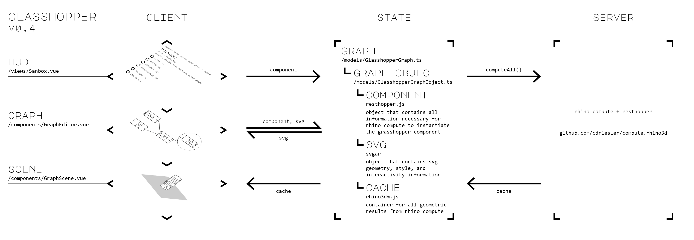

# Glasshopper

*The grasshopper glossary. It's grasshopper, but just a little more transparent.*

Glasshopper is a web-based grasshopper client powered by [svgar](https://github.com/cdriesler/svgar) in the frontend and [resthopper](https://github.com/cdriesler/compute.rhino3d/blob/master/src/compute.geometry/ResthopperEndpoints.cs) in the backend. You can find a quick video of it in action [here](https://twitter.com/cdriesler/status/1216726073473490946).

## Scope

This project began as a simple proof-of-concept that completed in January 2020. I made a number of poor architectural decisions during this experimental phase, though, that prevented an immediate transition to a usable tool. (Unless you're ok using only 10 components at a time before chrome dies.) I'm currently improving the backbone graphics library, [svgar](https://github.com/cdriesler/svgar), and planning features for the next version of the project.

**February 2020**

- [ ] Dramatically improve performance of svgar's render loop
- [X] Enable svgar to render a 3D scene
- [ ] Adopt [rhino3dm.js](https://github.com/mcneel/rhino3dm/blob/master/docs/javascript/RHINO3DM.JS.md) as svgar's geometry system
- [X] Reduce payload size of [resthopper.js](https://github.com/cdriesler/resthopper)

**March 2020**

- [ ] Give glasshopper a facelift
- [ ] Add database to allow snippets to be saved and shared
- [ ] Convert the graph layer from 2D svgar to responsive native divs
- [ ] Convert the scene layer from three.js to 3D svgar

## How to run

Glasshopper is *not* comfortable to use in its current state. You can't even delete components. But if you would like to mess with it, you can serve it locally with the following steps:

- Install [node.js](https://nodejs.org/en/)
- Clone or download this repository
- Create a file named `.env` in the main directory
- Paste `VUE_APP_COMPUTE_SERVER=http://localhost:8081/rhino/grasshopper/evaluate` in that file and save
- Open a command prompt in the main directory
- Run `npm install`
- Run `npm run serve`

Vue should build and serve the web application. But in order to generate results, you also need to run the rhino compute server. To do so, clone or download [this](https://github.com/cdriesler/compute.rhino3d) repository and follow the steps outlined by McNeel [here](https://github.com/cdriesler/compute.rhino3d/blob/master/docs/installation.md).

The next version will be hosted online, I promise.
