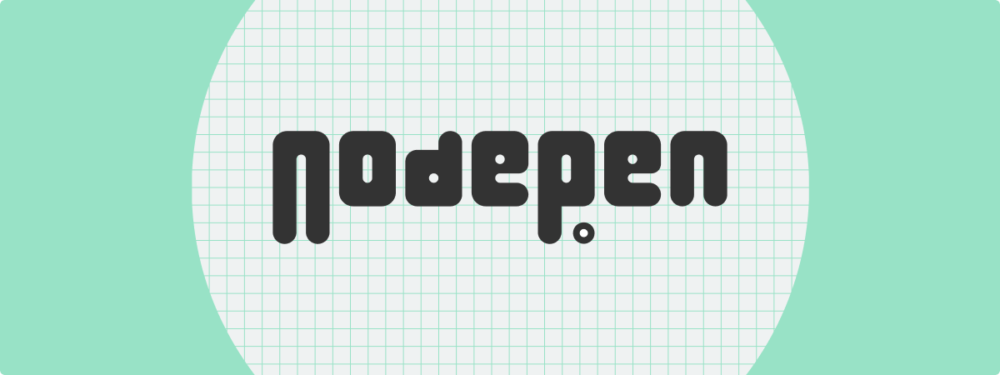

NodePen is a web client for Grasshopper. This repo contains the open-source node viewer library.

## Attribution

Rhinoceros and Grasshopper are registered trademarks of [Robert McNeel & Associates](https://www.rhino3d.com).

Previous drafts of NodePen included the ["RestHopper"](https://github.com/RESThopper/resthopper.grasshopper) headless Grasshopper prototype developed at the [2018 AEC Tech Hackathon](http://core.thorntontomasetti.com/aec-tech-2018/aec-tech-2018-hackathon/2018-aec-tech-hackathon-github-repos/).
