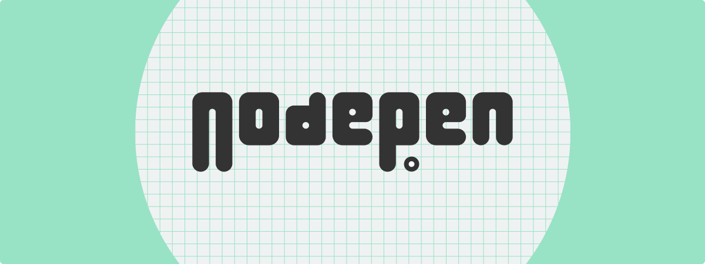

NodePen is a web client for Grasshopper. This repo contains the open-source node viewer library.

## Run locally

Check out the repo and run:

```
npm i
npm run build
npm run preview
```

This will open the minimal preview site at `/dev` and allow you to work with a limited set of nodes. This is _offline_ and _viewer-only_, so no solutions will run. This is useful for testing changes to node graphics and interactions, or passing your own `templates` and `document` shapes.

## Schema

A NodePen document is a JSON description of nodes, each with a reference to their "template" by id. Start from `Document.ts` in `/types` to understand the shape of each.

While the schema borrows some naming and conventions from Grasshopper, it is capable of describing (and, eventally, being converted to) any other graph format. Give it a try with yours. (:)

## Attribution

NodePen was not built alone: it's built on years of iterations and conversations at the pub and daydreaming at conferences with friends and colleagues in the industry about what Grasshopper can be. Some of its best ideas came from people who have contributed no code, and I'd like to list some here:

**Puja Bhagat** for suggesting various "re-displays" of the graph, like collapsing groups into a "meta" flow chart of the graph's logic.

**Ivneet Singh** for pushing search to include more than components, including the content of panels or other commentary throughout the graph.

**Maxime Fouillat** for @mentions in panels and the giggle it got out of me.

### Lore

The earliest drafts of NodePen included the ["RestHopper"](https://github.com/RESThopper/resthopper.grasshopper) headless Grasshopper prototype developed at the [2018 AEC Tech Hackathon](http://core.thorntontomasetti.com/aec-tech-2018/aec-tech-2018-hackathon/2018-aec-tech-hackathon-github-repos/).

[Failed 2022 launch]

### Legal

Rhinoceros and Grasshopper are registered trademarks of [Robert McNeel & Associates](https://www.rhino3d.com).


